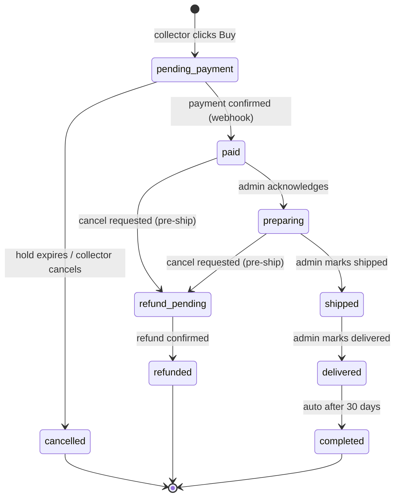

# 01 — Commerce Build Spec

**Status:** Draft v0.1 · 2026-07-15

Defines the order lifecycle for direct (buy-now) sales. Auction settlement
reuses this machine from `paid` onward — see [05 §6](05-auction-rules.md).

## 1. Definitions

- **Order** — one purchase attempt by one collector. Beta 2 orders contain a
  single artwork (`quantity` may be >1 only for editions). No multi-item cart.
- **Hold** — a temporary inventory reservation created with the order so two
  collectors can't buy the last print simultaneously.
- **Payment attempt** — a row in `payments`. An order can have several
  (e.g. a failed card then a successful one); at most one ever succeeds.

## 2. Order state machine

| State | Meaning | Inventory | Money |
|---|---|---|---|
| `pending_payment` | Order created, awaiting payment | Held (TTL 30 min) | None moved |
| `paid` | Payment settled | Committed (sold/edition decremented) | Captured |
| `preparing` | Studio preparing shipment | Committed | Captured |
| `shipped` | Tracking number recorded. **Refund window closes here.** | Committed | Captured |
| `delivered` | Marked delivered (manual in beta 2) | Committed | Captured |
| `completed` | Terminal. Auto-set 30 days after `delivered` | Committed | Captured |
| `cancelled` | Terminal. Expired hold or pre-payment cancel | Released | None moved |
| `refund_pending` | Cancel approved pre-ship, refund executing | Released | Refund in flight |
| `refunded` | Terminal | Released | Returned |

**Transition guards** (enforced in Edge Functions, never in the client):
- Only webhook handlers may set `paid` or `refunded`.
- `refund_pending` is only reachable from `paid` or `preparing` — never from
  `shipped` or later (sales final once shipped; see §5).
- Any transition not in the diagram is rejected and logged to
  `admin_audit_log` with the attempted transition.

## 3. When an artwork is sold (happy path)

1. **Order creation** — client calls `create-order` Edge Function with
   `art_piece_id`, `quantity`, rail (`stripe` | `crypto`), shipping address.
   Function validates availability, creates `orders` row (`pending_payment`),
   creates hold (for 1/1s: `art_pieces.status = held`; for editions:
   increments `editions_held`), and:
   - **Stripe rail:** creates a Stripe Checkout Session (`expires_at` = 30 min,
     `metadata.order_id` set) and returns its URL.
   - **Crypto rail:** returns payment instructions: treasury address, exact
     USDC amount (6-decimal integer), `order_id`.
2. **Payment**
   - **Stripe:** collector pays on Stripe-hosted checkout.
   - **Crypto:** frontend builds a USDC `transfer` from the collector's Privy
     wallet to the treasury, submits it, then calls
     `submit-crypto-payment(order_id, tx_hash)`. The Edge Function records a
     `payments` row (`processing`) — **it does not trust the client**;
     confirmation happens in step 3.
3. **Confirmation (webhook, §6)** — sets payment `succeeded` and order `paid`,
   commits inventory, writes `reward_events` (status `pending`, see 06),
   enqueues an order-confirmation notification.
4. **Fulfillment** — admin moves `paid → preparing → shipped` (tracking number
   required to mark shipped). Marking shipped flips the order's reward events
   to `claimable` (06 §4) and enqueues a shipped notification.
5. **Completion** — admin marks `delivered`; a scheduled function promotes
   `delivered → completed` after 30 days.

## 4. Failed payment behavior

- **Stripe failure** (`payment_intent.payment_failed`): mark the `payments`
  row `failed`. The order stays `pending_payment`; the collector can retry
  within the hold TTL. When the Checkout Session expires
  (`checkout.session.expired`), cancel the order and release the hold.
- **Crypto failure:** the confirmation worker rejects the tx if any of:
  wrong token, wrong recipient, amount below quoted, reverted, or not
  confirmed within 30 min. `payments` row → `failed` with a reason code;
  order behaves as above (retry allowed until hold expiry).
- **Underpayment/overpayment (crypto):** underpayment = failure (no partial
  credit in beta 2). Overpayment = success; the delta is recorded on the
  `payments` row and refunded manually by admin.
- **Hold expiry:** a scheduled function (`expire-holds`, every 5 min) cancels
  `pending_payment` orders past `hold_expires_at` and releases inventory.
- **Late payment after expiry** (crypto tx lands after the order was
  cancelled): payment is recorded as `orphaned`; admin sees it in a
  reconciliation queue and either revives the order (if inventory still
  available) or refunds. Never silently kept.

## 5. Refund / cancel behavior

Policy: **sales are final once shipped.** Before shipping, cancellation is
free and full.

- `pending_payment`: collector cancels self-serve → `cancelled`. No money moved.
- `paid` / `preparing`: collector requests cancel (self-serve button) →
  `refund_pending`, inventory released immediately.
  - **Stripe:** Edge Function issues `refunds.create`; `charge.refunded`
    webhook confirms → `refunded`.
  - **Crypto:** refund is a USDC transfer from treasury back to the paying
    wallet, **executed by admin from the admin panel** (beta 2 keeps treasury
    keys out of automated paths). Recording the refund tx hash → `refunded`.
- `shipped` and later: no self-serve path. Exceptional cases (damage, loss)
  are handled by admin as a **manual grant/refund with a reason code**,
  logged to `admin_audit_log`. The state machine is not extended for these.
- **Disputes:** `charge.dispute.created` freezes the order (flag
  `disputed = true`, admin notified). Reward events for a refunded or
  disputed order are voided/clawed back (06 §6).

## 6. Webhook responsibilities

All handlers are Edge Functions. Shared rules: **verify signature first**,
**insert event id into `webhook_events` before acting** (unique constraint =
idempotency; duplicate delivery is a no-op), act inside one transaction,
return 200 only after commit.

| Source | Event | Responsibility |
|---|---|---|
| Stripe | `checkout.session.completed` | Payment `succeeded`; order → `paid`; commit inventory; write reward events; enqueue confirmation notification |
| Stripe | `payment_intent.payment_failed` | Payment `failed`; order unchanged |
| Stripe | `checkout.session.expired` | Cancel order, release hold (if still `pending_payment`) |
| Stripe | `charge.refunded` | Order `refund_pending → refunded`; void reward events |
| Stripe | `charge.dispute.created` | Flag order disputed; notify admin; freeze reward events |
| Alchemy (Base) | Address activity on treasury | Backstop for crypto payments: match incoming USDC to open orders; also feeds the reconciliation queue for orphaned payments |
| Internal cron | `confirm-crypto-payments` (1 min) | For `processing` crypto payments: verify tx onchain (recipient, token, amount, ≥ N confirmations) → succeed or fail per §4 |
| Internal cron | `expire-holds` (5 min) | Cancel expired `pending_payment` orders |
| Internal cron | `complete-orders` (daily) | `delivered → completed` after 30 days |

**Ordering hazard:** Stripe events can arrive out of order. Handlers must
check current order state and no-op (log, don't error) on impossible
transitions.

## 7. What data gets written where

| Moment | Writes |
|---|---|
| Order created | `orders` (new, `pending_payment`, address snapshot); `art_pieces` (hold) |
| Checkout session / crypto quote issued | `payments` (new, `pending`, rail, amounts, session id or quoted USDC) |
| Crypto tx submitted | `payments.tx_hash`, status `processing` |
| Payment confirmed | `payments` → `succeeded`; `orders` → `paid`; `art_pieces` commit (1/1 → `sold`, edition counters); `reward_events` (pending); `notifications` (outbox); `webhook_events` |
| Marked shipped | `orders` (status, tracking, `shipped_at`); `reward_events` → `claimable`; `notifications` |
| Cancel/refund | `orders`; `payments` (refund reference); `art_pieces` (release); `reward_events` → `voided`; `notifications` |
| Every admin transition | `admin_audit_log` |

Column-level detail lives in [03 — Data model](03-data-model.md).

## 8. Shipping & customs (resolved 2026-07-15)

Buyer pays shipping; rates come from the `shipping_rates` config table
(zone × size bucket), snapshotted onto the order as `shipping_cents`.

| Size bucket | US | Canada | International |
|---|---|---|---|
| `print` (rolled, tube) | $15 | $30 | $50 |
| `small` (original ≤ 24″ longest side) | $50 | $90 | $150 |
| `medium` (original ≤ 40″) | $100 | $180 | $300 |
| `large` (original > 40″) | $250 | **quote only** | **quote only** |

- Rates are admin-editable defaults, benchmarked 2026-07 (couriers €80–400
  typical for paintings; large canvases $500–2,500 — hence quote-only).
- **Quote-only combinations block instant checkout**: the UI shows
  "Contact the studio for shipping" and admin enters a manual order with a
  bespoke shipping amount.
- All shipments insured to sale price; originals require delivery signature.
- **Incoterm: DDU/DAP** — import duties, VAT, and customs fees are the
  collector's responsibility, stated at checkout and in the confirmation
  email. Customs delays don't extend any deadline in this spec.
- Treasury for crypto payments:
  `0x30c92610f22203a728f4762e40d23a652feba946` (verified EIP-7702 smart
  wallet on Base). It holds no ETH — automated *outbound* transfers
  (future automated refunds) need gas funding or a paymaster first, which
  is why beta 2 keeps crypto refunds admin-executed.

## 9. Open questions

- Crypto confirmation depth on Base: spec assumes **10 blocks (~20s)** — confirm.
- Sales tax / VAT on the studio side (Stripe Tax?) — distinct from import
  duties, which are the buyer's per §8.
- Excluded destination countries list (sanctions/carrier coverage) — needs
  a definitive enumeration before launch.

## Changelog

- v0.2 (2026-07-15) — Added §8 shipping & customs (tiered flat rates, DDU,
  quote-only large intl); recorded treasury address; resolved shipping and
  treasury open questions.
- v0.1 (2026-07-15) — Initial draft from decisions locked with Jay.
