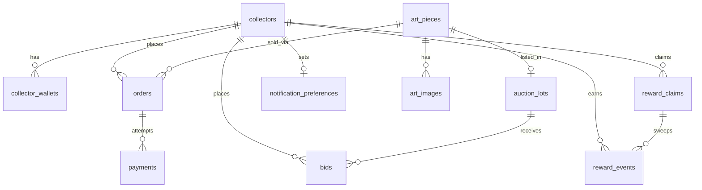

# 03 — Data Model Spec

**Status:** Draft v0.1 · 2026-07-15

All tables in Supabase Postgres, `public` schema. Every table has `id uuid pk
default gen_random_uuid()`, `created_at`, `updated_at` unless noted. Money is
integer minor units: `*_cents` (USD) or `*_usdc` (6-decimal USDC integer).
State columns are Postgres enums matching the names in these specs exactly.

## Identity

### `collectors`
| Column | Type | Notes |
|---|---|---|
| `privy_did` | text **unique** | Canonical external identity (02 §2) |
| `email` | text | Mirrored from Privy; notifications + settlement links |
| `display_name` | text | Optional public handle (shown masked in bid history) |
| `bidding_suspended` | bool default false | Set after 2 settlement defaults (05 §6) |

### `collector_wallets`
| Column | Type | Notes |
|---|---|---|
| `collector_id` | fk collectors | |
| `address` | text | Base address, checksummed; **unique** |
| `is_primary` | bool | Exactly one true per collector (partial unique index); reward claims pay here |
| `verified_at` | timestamptz | Via Privy ownership proof |

### `user_roles`
`collector_id` fk · `role` enum(`admin`) · `granted_by` fk collectors ·
`granted_at`. Unique on (`collector_id`, `role`).

## Catalog

### `art_pieces`
| Column | Type | Notes |
|---|---|---|
| `title`, `description`, `medium`, `dimensions`, `year` | text/int | |
| `kind` | enum(`original`, `edition`) | |
| `size_bucket` | enum(`print`, `small`, `medium`, `large`) | Drives shipping rate lookup (01 §8) |
| `tags` | text[] default '{}' | Curated filter chips for Discover (08 §4); GIN index |
| `series` | text null | Series name for Home narrative grouping (08 §1) |
| `status` | enum(`draft`, `available`, `held`, `on_auction`, `sold`, `archived`) | `held`/`sold` apply to originals; editions use counters |
| `price_cents` | int | Buy-now price (null while auction-only) |
| `edition_size` | int null | Editions only |
| `editions_sold` | int default 0 | |
| `editions_held` | int default 0 | Active holds; `available = size − sold − held` |
| `published_at` | timestamptz | Null = draft not yet public |

### `art_images`
`art_piece_id` fk · `storage_path` text (Supabase Storage, 04 §3) ·
`sort_order` int · `is_primary` bool · `alt_text` text ·
`media_kind` enum(`image`, `video`) default `image` (video display is a
stretch goal, 07; schema is ready so uploads don't need a migration).

Price-tier filter bands (affordable/expensive/luxurious, 08 §4) are
config values mapped from `price_cents` at query time — no column.

## Commerce

### `orders`
| Column | Type | Notes |
|---|---|---|
| `collector_id` | fk | |
| `art_piece_id` | fk | Single artwork per order (01 §1) |
| `quantity` | int default 1 | >1 only for editions |
| `source` | enum(`direct`, `auction`) | |
| `auction_lot_id` | fk null | Set when `source = auction` |
| `status` | enum per 01 §2 | `pending_payment` … `refunded` |
| `rail` | enum(`stripe`, `crypto`) | |
| `subtotal_cents`, `shipping_cents`, `total_cents` | int | Snapshot at order time |
| `shipping_address` | jsonb | Snapshot — never a live fk |
| `hold_expires_at` | timestamptz | 01 §4 |
| `tracking_number`, `shipped_at`, `delivered_at` | | |
| `disputed` | bool default false | |

### `payments`
| Column | Type | Notes |
|---|---|---|
| `order_id` | fk | Many attempts per order; partial unique index: one `succeeded` per order |
| `rail` | enum(`stripe`, `crypto`) | |
| `status` | enum(`pending`, `processing`, `succeeded`, `failed`, `orphaned`) | |
| `amount_cents` | int null | Stripe rail |
| `amount_usdc` | bigint null | Crypto rail: quoted amount |
| `received_usdc` | bigint null | Actual, for over/underpayment (01 §4) |
| `stripe_session_id`, `stripe_payment_intent` | text | |
| `tx_hash` | text | Crypto; unique |
| `failure_reason` | text | Reason code |
| `refund_reference` | text | Stripe refund id or refund tx hash |

### `shipping_rates` (admin-editable config)
`zone` enum(`us`, `canada`, `international`) · `size_bucket` (same enum as
`art_pieces`) · `amount_cents` int null — **null = quote only**, blocks
instant checkout (01 §8). Unique (`zone`, `size_bucket`). Seeded with the
01 §8 defaults.

### `webhook_events`
`source` enum(`stripe`, `alchemy`) · `external_id` text · `payload` jsonb ·
`processed_at`. **Unique (`source`, `external_id`)** — this constraint *is*
the idempotency mechanism (01 §6).

## Auctions

### `auction_lots`
| Column | Type | Notes |
|---|---|---|
| `art_piece_id` | fk | Guard: piece not `sold`/`held`/in another live lot |
| `status` | enum(`draft`, `scheduled`, `live`, `extended`, `closed_pending_settlement`, `settled`, `passed`, `cancelled`) | 05 §2 |
| `starts_at`, `ends_at` | timestamptz | `ends_at` moves on soft-close extension |
| `original_ends_at` | timestamptz | Immutable, for audit |
| `starting_bid_cents` | int | |
| `reserve_cents` | int null | Hidden from clients (05 §4) |
| `current_bid_cents` | int null | Denormalized top bid |
| `winning_bid_id` | fk bids null | |
| `settlement_deadline` | timestamptz null | Win time + 48h (05 §6) |

### `bids`
| Column | Type | Notes |
|---|---|---|
| `auction_lot_id` | fk | |
| `collector_id` | fk | |
| `amount_cents` | int | Validated ≥ min increment at insert (05 §3) |
| `status` | enum(`active`, `outbid`, `winning`, `won`, `lost`, `cancelled_default`) | |
| `placed_at` | timestamptz | Server clock only |

Insert-only; rows are never updated except `status`. Public read exposes
amount + masked bidder (`display_name` initial or "Collector #n"), never ids.

## Rewards

### `reward_events`
| Column | Type | Notes |
|---|---|---|
| `collector_id` | fk | |
| `kind` | enum(`purchase`, `auction_win`, `bid_participation`, `manual_grant`, `clawback`) | |
| `amount_tokens` | bigint | 18-decimal integer; negative for `clawback` |
| `status` | enum(`pending`, `claimable`, `claimed`, `voided`) | Lifecycle in 06 §4 |
| `order_id` / `auction_lot_id` | fk null | Provenance; unique (`collector_id`,`kind`,`auction_lot_id`) blocks double participation rewards |
| `reason` | text | Required for `manual_grant`/`clawback` |
| `granted_by` | fk collectors null | Manual grants |
| `claim_id` | fk reward_claims null | Set when swept into a claim |

### `reward_claims`
| Column | Type | Notes |
|---|---|---|
| `collector_id` | fk | |
| `wallet_address` | text | Snapshot of primary wallet at claim time |
| `amount_tokens` | bigint | Sum of swept events |
| `status` | enum(`pending`, `submitted`, `confirmed`, `failed`, `needs_attention`) | 06 §5–6 |
| `idempotency_key` | text unique | Prevents double-mint across retries |
| `tx_hash` | text | |
| `attempt_count` | int default 0 | |
| `last_error` | text | |

## Notifications

### `notification_preferences`
`collector_id` fk unique · booleans per category: `order_updates`,
`outbid_alerts`, `auction_results`, `reward_updates`, `studio_news`.
**Only table with direct client write (own row, RLS).**

### `notifications` (outbox)
`collector_id` fk · `category` (matches preference flags) · `channel`
enum(`email`) · `template` text · `payload` jsonb · `status`
enum(`queued`, `sent`, `failed`, `suppressed`) · `sent_at`. Writers enqueue;
a worker sends and respects preferences (`suppressed` when opted out).

## Admin / audit

### `admin_audit_log` (insert-only)
`actor_collector_id` fk null (null = system/cron) · `action` text
(e.g. `order.mark_shipped`) · `entity_type` + `entity_id` · `before` jsonb ·
`after` jsonb · `reason` text · `denied` bool default false (02 §4).
Every admin Edge Function writes one row per mutation.

## Relationships (summary)

## RLS matrix

| Table | anon SELECT | collector write | Everything else |
|---|---|---|---|
| `art_pieces` (published), `art_images`, `auction_lots` (non-draft, reserve column excluded via view), `bids` (masked view) | ✅ | — | Edge Functions only |
| `notification_preferences` | own row | own row | — |
| All other tables | ❌ | ❌ | Edge Functions only |

## Open questions

- Retention for `webhook_events` payloads (contain addresses/emails) —
  propose 90 days then strip payload, keep ids.

*(Resolved 2026-07-15: shipping is a `shipping_rates` zone × bucket table,
snapshotted to `orders.shipping_cents` at order time.)*

## Changelog

- v0.3 (2026-07-15) — Beta feedback: `art_pieces.tags` + `series`,
  `art_images.media_kind`; price tiers noted as config, not a column.
- v0.2 (2026-07-15) — Added `art_pieces.size_bucket` and `shipping_rates`.
- v0.1 (2026-07-15) — Initial draft.
