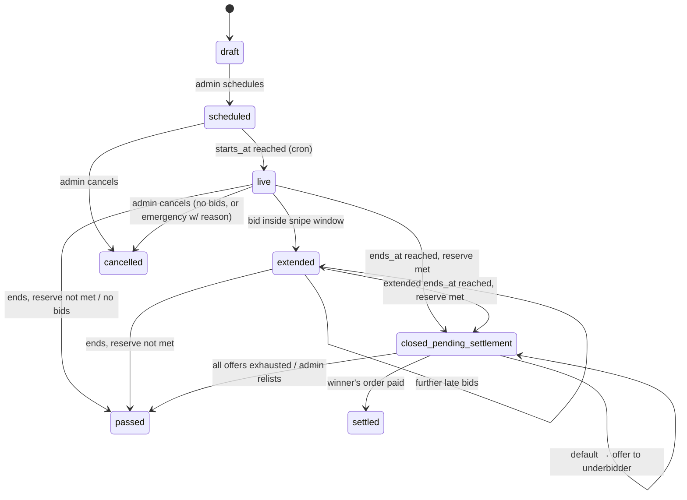

# 05 — Auction Rules Spec

**Status:** Draft v0.1 · 2026-07-15

English (ascending) auctions, straight bids only. All numeric values in this
doc are **editable defaults** stored in config, not constants scattered in
code.

## 1. Definitions

- **Soft close** — the end time extends when late bids arrive (§5).
- **Passed** — lot ended with no bid meeting the reserve; artwork returns to
  `available`.
- **Default** — a winner who misses the settlement deadline.

## 2. Lot state machine

The `close-auctions` cron (every minute) performs the time-based
transitions; **client clocks are never trusted** — `placed_at` and closing
decisions use server time only.

## 3. Bid validity & increments

A bid is accepted only if **all** hold at insert time (checked in
`place-bid` inside a transaction with the lot row locked):

1. Lot is `live` or `extended`, and server time < `ends_at`.
2. Bidder is authenticated, not `bidding_suspended`, and not the current
   high bidder (no self-outbidding to inflate).
3. Amount ≥ `starting_bid` (first bid) or ≥ current bid + minimum increment:

| Current bid | Min increment |
|---|---|
| < $100 | $10 |
| $100 – $499 | $25 |
| $500 – $999 | $50 |
| $1,000 – $4,999 | $100 |
| $5,000 – $9,999 | $250 |
| ≥ $10,000 | $500 |

On accept: previous top bid → `outbid` (+ outbid notification), new bid →
`winning` status on the lot's denormalized fields. Rejections return typed
error codes (`BID_TOO_LOW`, `AUCTION_ENDED`, …) so the UI can react without
string matching. Bids are **binding** — no retraction in beta 2.

**Not in beta 2:** proxy/maximum bidding (auto-bid up to a cap). Straight
bids only; see §8.

## 4. Reserve behavior

- `reserve_cents` is optional, set at lot creation, **never exposed to
  clients** (excluded from the public view at the column level, not the UI).
- UI shows a boolean only: **"Reserve not met"** until a bid ≥ reserve, then
  **"Reserve met"**.
- Bids below reserve are still accepted and recorded (they establish
  interest and drive increments); they simply can't win.
- At close with top bid < reserve → lot `passed`. Admin may contact the high
  bidder off-platform; any resulting sale is entered as a manual direct
  order, not a falsified auction result.
- Reserve is immutable once the lot is `live`.

## 5. Anti-sniping (soft close)

- **Snipe window: final 10 minutes.** Any accepted bid with
  `ends_at − placed_at < 10 min` sets `ends_at = placed_at + 10 min` and the
  lot → `extended`.
- Extensions are unlimited — the auction ends only after 10 quiet minutes.
- `original_ends_at` is preserved for audit; the UI shows a live countdown
  and an "extended" badge so the rule is transparent to bidders.

## 6. Winning / settlement flow (beta 2: checkout link + deadline)

1. At close with reserve met: top bid → `won`, others → `lost`; lot →
   `closed_pending_settlement`; an **order** is created for the winner
   (`source = auction`, `status = pending_payment`, total = hammer price +
   shipping + buyer's premium) with a **settlement checkout link** (Stripe
   or crypto — winner's choice at payment time).
   **Buyer's premium is 0% in beta 2** (`buyers_premium_bps = 0`, config):
   major houses charge 26–28% as intermediaries, but an artist-direct
   studio keeps the hammer price anyway — a premium would only obscure
   pricing. The config knob exists so introducing one later (e.g. for
   curated third-party sales) is a setting change with notice to bidders,
   not a rebuild.
2. `settlement_deadline = close + 48h`. Winner is notified immediately
   (email + in-app); reminder at 24h remaining.
3. **Winner pays** → order `paid` (commerce machine, 01, takes over) → lot
   `settled`. Reward events for the win are written at payment, not at
   hammer (06 §3).
4. **Winner defaults** (deadline passes, checked by `settlement-deadlines`
   cron): winning bid → `cancelled_default`; the collector gets a default
   strike (**2 strikes → `bidding_suspended`**, admin-reversible). Admin
   then chooses per lot:
   - **Offer to underbidder** at *their own last bid amount* — new order +
     48h deadline, repeatable down the bid ladder, or
   - **Relist** (new lot) or **pass** the lot.
   Nothing automatic here in beta 2 — a defaulted lot is an admin decision.
5. An unsold settlement (all offers exhausted) returns the artwork to
   `available`.

## 7. Next milestone: onchain escrow bidding (designed, not built)

Decision from 2026-07-15: the end state is **hybrid settlement** — crypto
bidders escrow USDC at bid time; fiat bidders keep the checkout-link flow.

Sketch to design against (full spec when the milestone starts):
- Escrow contract on Base holds USDC per (lot, bidder); being outbid
  auto-refunds; winning locks the funds for direct settlement at close —
  an escrow-backed winner **cannot default**.
- Mixed ladders resolve naturally: if a fiat winner defaults and the
  underbidder is escrow-backed, settlement is instant.
- Contract emits `BidPlaced`/`Refunded`/`Settled`; the indexer webhook
  mirrors them into `bids` so Supabase remains the read model.

## 8. Disabled / out of scope in beta 2

| Feature | Status |
|---|---|
| Onchain escrow bidding | Placeholder — §7, next milestone |
| Proxy / maximum bidding | Out |
| Auto-charge winners (saved card / SetupIntent) | Out |
| Bid retraction | Out |
| Editions in auctions | Out (originals only) |
| Automatic underbidder offers | Out (admin-triggered only) |

## 9. Open questions

- Default settlement deadline: 48h assumed — confirm (art-world norm is
  24–72h).
- Should the snipe window (10 min) differ for short (24h) lots?

*(Resolved 2026-07-15: buyer's premium is 0% in beta 2, kept as config —
see §6.)*

## Changelog

- v0.2 (2026-07-15) — Buyer's premium resolved: 0% in beta 2, kept as config.
- v0.1 (2026-07-15) — Initial draft.
