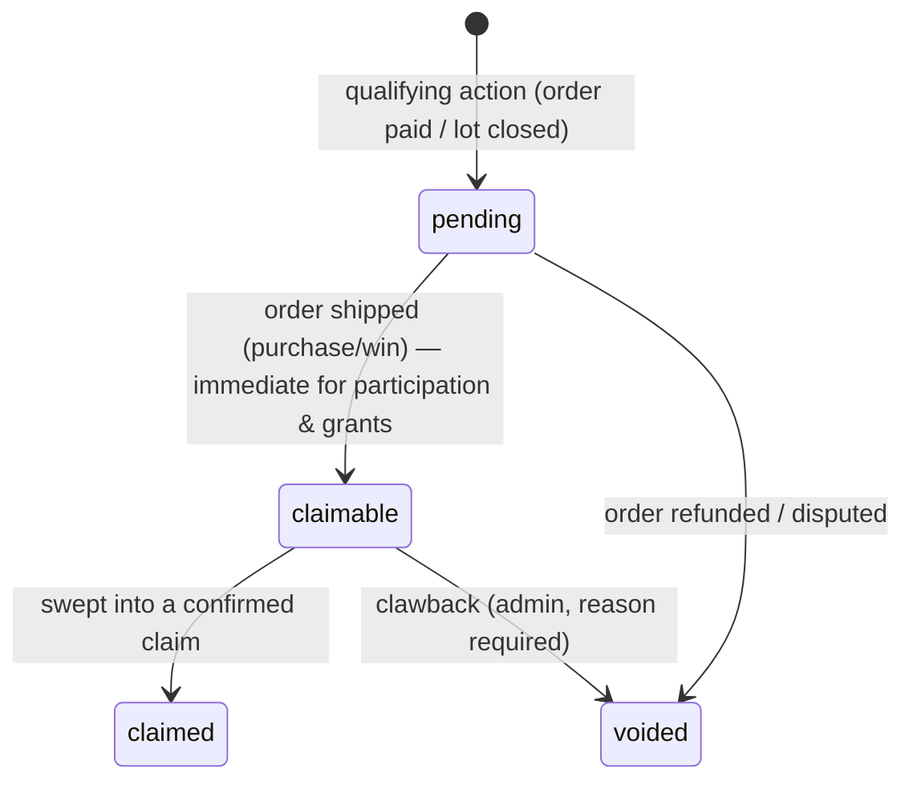

# 06 — Rewards Spec

**Status:** Draft v0.1 · 2026-07-15

## 1. What the token is

**`jga_studio`** — a deployed ERC-20 on **Base** at
`0xcc3b754f6f3c508518ba7d0920f944d800c14b9a`
(verified onchain 2026-07-15: 18 decimals, total supply **1,000,000,000**
pre-minted, 59 holders at verification). The docs' shorthand "$JGA" refers
to this token.

Supabase is the ledger of record for *earned-but-unclaimed* balances
(`reward_events`); the chain is the record of *claimed* tokens. Because the
supply is pre-minted, **claims are `transfer`s from the rewards wallet, not
mints**.

**Rewards wallet:** `0xf840b0b61db60daa04a4038f69e9d4b39a31a7af` — a
verified EIP-7702 smart wallet, distinct from the commerce treasury.
Starting float: **8,000,000 $JGA** (0.8% of supply), topped up over time as
accruals grow. A low-balance alert (float below ~30 days of projected
claims, or gas below ~20 claims' worth) goes to the admin queue, and
`request-claim` refuses new claims that would exceed the current float
(collector sees "claims temporarily paused") rather than letting the worker
fail onchain.

**Funding status (verified onchain 2026-07-15):** the wallet holds the
8,000,000 $JGA float (received in tx
`0xb7cd9911bf1c7dc94e901720f4fc547cb746ab72c3c503595802a9a618661345`) and
~0.0093 ETH for gas. **Gas strategy: plain ETH funding** — an ERC-20
transfer on Base costs a fraction of a cent, so this covers thousands of
claims; the low-balance alert above triggers a top-up. A paymaster remains
an option later but is not part of beta 2.

All earn rates below are **config values, editable by admin**, with the
launch defaults shown. Amounts stored as 18-decimal integers.

## 2. What earns rewards

| Kind | Trigger | Default rate | Anti-abuse guard |
|---|---|---|---|
| `purchase` | Order reaches `paid` | **10 $JGA per $1** of subtotal (excl. shipping) | Voided on refund (§6) |
| `auction_win` | Auction order reaches `paid` | Purchase rate **+25% bonus** on hammer price | Written at payment, never at hammer — defaulters earn nothing |
| `bid_participation` | Lot closes | **25 $JGA flat** per lot the collector placed ≥1 valid bid on | Once per (collector, lot) — DB unique constraint; only lots that received ≥3 distinct bidders qualify; cancelled lots pay nothing |
| `manual_grant` | Admin action (04 §6) | Any amount, reason required | Audited; threshold confirmation |

Bid-participation deliberately pays **per lot, not per bid**, and only on
genuinely contested lots — farming by ping-ponging bids with a friend earns
one flat payment each and risks binding-bid exposure, which makes farming
economically stupid rather than merely forbidden.

## 3. Reward event lifecycle

## 4. When rewards become claimable

- `purchase` / `auction_win`: **when the order is marked `shipped`** — the
  moment the refund window closes (01 §5). This makes "refund after
  claiming" structurally impossible for the normal path.
- `bid_participation`: immediately `claimable` at lot close (no refund risk).
- `manual_grant`: immediately `claimable`.
- If an order is refunded *while events are `pending`*, they are `voided` —
  nothing to unwind onchain. Post-shipped exceptional refunds (01 §5) pair
  with a `clawback` event (§6).

## 5. Claim flow

1. Collector hits **Claim** → `request-claim` Edge Function.
2. Guards: verified primary wallet exists; claimable balance ≥ **minimum
   claim of 100 $JGA** (dust/gas guard); no `pending`/`submitted` claim
   already open for this collector (one in flight at a time).
3. Function atomically sweeps all `claimable` events into a new
   `reward_claims` row (`pending`, `idempotency_key`, wallet snapshot) and
   marks the events `claimed`-pending via `claim_id`.
4. `process-claims` worker (cron, 1 min) submits the mint/transfer from the
   **rewards server wallet** (distinct from the commerce treasury; funded
   with gas only + minter role or token float). Claim → `submitted` with
   `tx_hash`.
5. On ≥10 Base confirmations → `confirmed`; collector notified. The UI
   shows pending / claimable / claimed buckets throughout.

Gas is paid by the studio wallet — collectors never need ETH to claim.

## 6. How claims fail and retry

| Failure | Behavior |
|---|---|
| RPC error / nonce clash / gas spike before submission | Retry with exponential backoff (1 min, 5 min, 25 min); `attempt_count++` |
| Tx submitted but dropped/not mined in 30 min | Rebroadcast **same idempotency path**: check receipt first, resubmit only if provably absent — never two live txs per claim |
| Reverted onchain | Claim → `failed`, `last_error` recorded; auto-retry once, then escalate |
| 3 failed attempts | Claim → `needs_attention`; admin queue + admin notification; collector sees "processing — we're on it", not an error dump |
| Wallet unlinked mid-claim | Claim uses the **snapshot** address (03) — proceeds; changing wallets affects future claims only |

**Invariants:** the `idempotency_key` and one-open-claim rule make
double-mint impossible; a `needs_attention` claim resolved manually is
marked `confirmed` with the manual `tx_hash`. `claimed` events are never
returned to `claimable` — a truly failed claim is `cancelled` by admin,
which releases its events back to `claimable` in the same transaction.

**Clawback** (post-shipped refund, fraud): negative `reward_events` row.
If the collector's unclaimed balance covers it, it nets out at next claim.
If they already claimed, the balance goes negative and future earnings net
against it — we do not attempt onchain seizure.

## 7. What token utility means (beta 2 and direction)

Beta 2 ships **accrual + claiming + one utility**:

- **Priority access:** holders above a threshold (default 1,000 $JGA,
  checked onchain at page load) see new drops 48h before public listing.

Directional (later milestones, not promised in UI): bidder-tier perks,
discounts on editions, gated studio content/events. **Explicitly never:**
$JGA is not equity, not revenue share, and the UI never presents it as an
investment — copy in the app must say "collector rewards," not anything
implying financial return.

## 8. Open questions

- Earn-rate review cadence — rates are config, but who signs off changes?

*(Resolved 2026-07-15: contract exists — `jga_studio` at `0xcc3b…4b9a`,
pre-minted 1B supply → claims are transfers, not mints. Rewards wallet is
`0xf840…a7af`, funded with the 8M $JGA float + ETH gas; gas strategy is
plain ETH. See §1.)*

## Changelog

- v0.4 (2026-07-15) — Rewards wallet funding verified onchain (8M $JGA +
  ETH gas); gas strategy resolved to plain ETH.
- v0.3 (2026-07-15) — Rewards wallet recorded (`0xf840…a7af`, 8M $JGA
  starting float); launch funding prerequisites and float-cap claim guard
  added.
- v0.2 (2026-07-15) — Token verified onchain (`jga_studio`, 1B pre-minted):
  claims are transfers; rewards-wallet float/gas requirements added.
- v0.1 (2026-07-15) — Initial draft.
